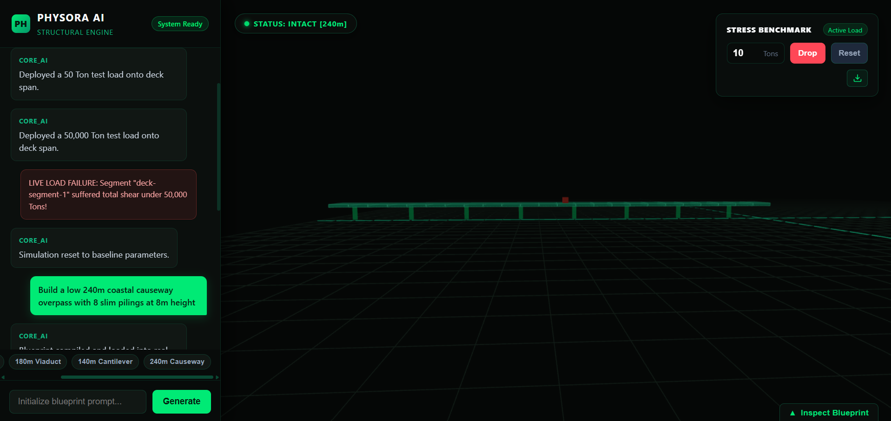
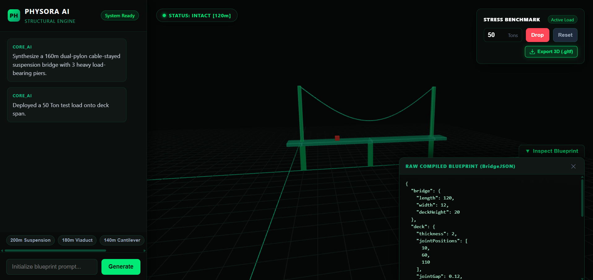
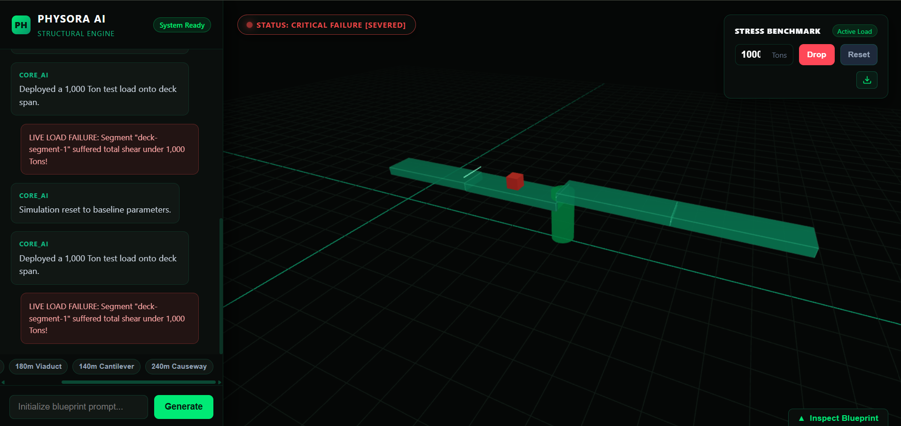

# PHYSORA

> Generative Structural Engineering & Real-Time Physics Validation Simulator
Visit the Deployed Website: https://keshav-sikka.github.io/PHYSORA/

[](./media/demo_video.mp4)

> 📹 **[Click here to view / play the full System Demo Video (demo_video.mp4)](./media/demo_video.mp4)**

PHYSORA is an AI-powered simulation engine that translates natural language architectural prompts into parametric exportable 3D structural models and tests their physical integrity under real-time stress dynamics. Built for hackathon evaluation, it targets civil engineers and architects looking to prototype and benchmark bridge blueprints before commissioning physical structures.

---

## Architecture Overview

PHYSORA operates as a pipeline connecting generative language models, 3D parametric rendering, and deterministic rigid-body impulse physics.

```text
+-----------------------+       +-------------------------+       +------------------------+
|   User Natural Text   | ----> |      Gemini 3.6 LLM     | ----> |   Structured Blueprint |
|   "180m Dual-Pylon"   |       |   (Parametric Schema)   |       |      (BridgeJSON)      |
+-----------------------+       +-------------------------+       +------------------------+
                                                                               |
                                                                               v
+-----------------------+       +-------------------------+       +------------------------+
|   Three.js Viewport   | <---- |  PhysicsBridgeAdapter   | <---- |     BridgeBuilder      |
|  (Hologram Rendering) |       |  (Vector Translation)   |       |   (Assembly Engine)    |
+-----------------------+       +-------------------------+       +------------------------+
            |                               |
            v                               v
+---------------------------------------------------------+
|                Rapier3D Physics Core                    |
|    (Impulse Joints, Dynamic Shear, Real-Time Stress)    |
+---------------------------------------------------------+
```


---

## Data Pipeline Sequence

```text
[User Prompt]
      │
      ▼
[Gemini API (gemini-3.6-flash)] 
      │ Validates parameters against structural grammar
      ▼
[BridgeJSON Blueprint]
      │ Dimensions, joint intervals, pier positions, cable specs
      ▼
[BridgeBuilder (Three.js)]
      │ Generates visual geometries and computes PhysicsManifest
      ▼
[PhysicsBridgeAdapter]
      │ Translates array tuples to vector objects, calculates
      │ relative anchor offsets, and scales collision gaps
      ▼
[Rapier3D World]
      │ Instantiates dynamic bodies and impulse joints
      ▼
[Render / Simulation Loop]
      │ Steps simulation (60 FPS) and syncs transforms to visual meshes
      ▼
[Stress Engine Benchmark]
      │ Evaluates concentrated loads and severs joints under critical shear
```



---

## Key Features & Technical Strengths

* **Zero-Hallucination Schema Enforcement:** The LLM generates strict, type-checked blueprints containing spatial coordinates, pillar radiuses, deck thicknesses, and joint intervals.
* **Seam-Collision Mitigation:** Solves contact chatter across adjacent segmented road slabs via adaptive geometric shrinkage, isolating joint calculations from solver contact fighting.
* **Deterministic Shear Failure:** Tracks real-time strain and load application. Dropping excessive concentrated mass severs impulse constraints and triggers physical collapse.
* **Continuous Dead-Load Solver:** Evaluates self-weight moments and structural stability on every frame; unstable cantilever configurations fail naturally under gravity without requiring external load drops.
* **Unified Client Architecture:** Powered by Vite, running WebAssembly-compiled physics (Rapier3D) and WebGL rendering (Three.js) in a single unified thread with zero server overhead.



---

## Tech Stack

* **Language:** TypeScript
* **3D Visual Engine:** Three.js
* **Physics Simulator:** `@dimforge/rapier3d-compat` (Rapier3D WASM)
* **LLM Engine:** Google Gemini API (`gemini-3.6-flash`)
* **Tooling:** Vite, Node.js

---

## Local Development Setup

### Prerequisites
* Node.js (v18.0.0 or higher)
* npm (v9.0.0 or higher)
* Google Gemini API Key

### Installation

1. **Clone the repository:**
   ```bash
   git clone https://github.com/Keshav-Sikka/PHYSORA.git
   cd PHYSORA
   ```

2. **Install dependencies:**
   ```bash
   npm install
   ```

3. **Configure Environment Variables:**
   Copy `.env.example` to create your local `.env`:
   ```bash
   cp .env.example .env
   ```
   Open `.env` and paste your Gemini API key:
   ```env
   VITE_AI_API_KEY=your_gemini_api_key_here
   ```

4. **Start Development Server:**
   ```bash
   npm run dev
   ```
   Open `http://localhost:5173` in your browser.

---

## Team Contributions

* **Keshav Sikka** (Team Lead): Architectural design, LLM integration (`llm.ts`), full-stack frontend interface, camera auto-framing, audio synthesis, and the `PhysicsBridgeAdapter` interop layer linking Three.js and Rapier3D.
* **Abhishek Gupta**: Three.js visual assembly core (`bridge.ts`), parametric geometry generation, cable catenary curve calculations, and scene lighting.
* **Udit Jain**: Physics engine implementation (`physicsWorld.ts`, `PartFactory.ts`, `JointFactory.ts`), Rapier3D wrapper, fixed timestep accumulator, and impulse joint bindings.
* **Sarthak Singh**: Project pitch presentation, deck architecture, research documentation, and presentation collateral.